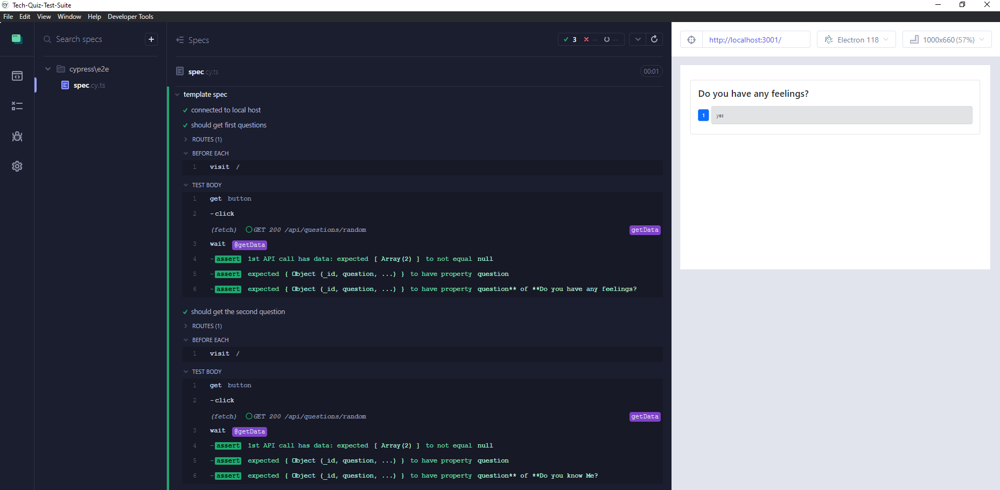

# Tech-Quiz-Test-Suite

  
  

## Description

The Tech Quiz Test Suite is a MERN stack web application designed for testing and improving technical knowledge through interactive quizzes. Users can take a 10-question quiz and receive instant scoring feedback. This project includes robust testing implemented with Cypress for end-to-end and component-level validation, ensuring reliability and performance across various use cases.


## Table of Contents

- [Tech-Quiz-Test-Suite](#tech-quiz-test-suite)
  - [Description](#description)
  - [Table of Contents](#table-of-contents)
  - [Installation](#installation)
  - [Usage](#usage)
  - [Tests](#tests)
  - [License](#license)
  - [Contributing](#contributing)


## Installation

Heres a [Link](https://drive.google.com/file/d/1JFyx8SiZYH4_h3Y2zlWLpD5L5URNYtdQ/view) to application demonstration.

 - Node.js (v16 or later recommended)
 - Npm or yarn package manager
 - MongoDB (local or cloud instance)
 - Run the test with Cypress package


## Usage

  Open the application in your browser using following steps:
  1. Clone the repository and navigate to project repository
  2. Install all dependencies
```
npm run install
```
  3. Run the server locally with development mode.
```
npm run start:dev
```
  4. Run cypress dependencies while having the application server running and direct to cypress app to run the e2e testing.
```
npm run cypress
```



## Tests

Application tested with noSQL MonogoDB Compass and Cypress.


## License

This project is licensed under the MIT License.


## Contributing

For questions or support, reach out via:

Email: parsamh8@gmail.com<br> 
GitHub: [parsamh](https://github.com/parsamh8)<br> 
[X](https://x.com/ParsaMh)
